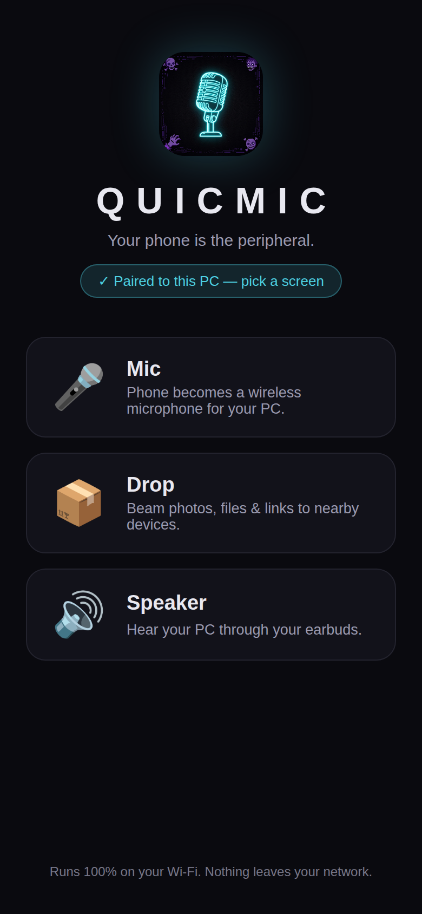
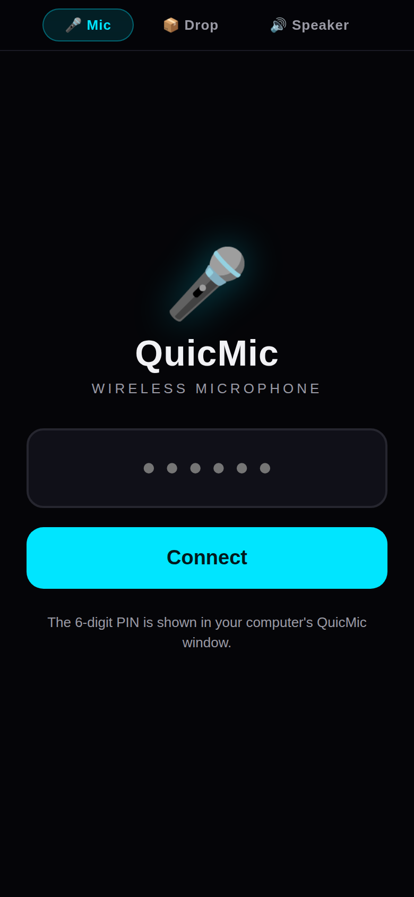
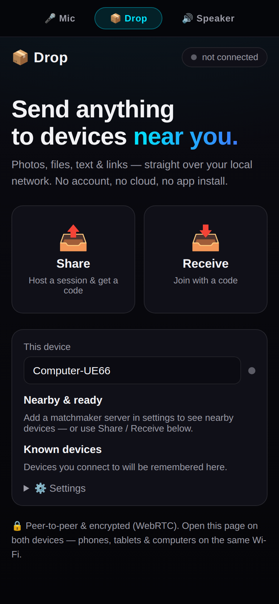
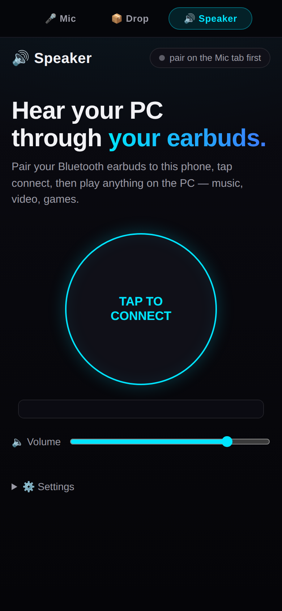

# QuicMic Zero UI

One Windows app, three screens. Your phone becomes a **wireless mic**, a **file-drop station**, and a **wireless speaker** for your PC — all over your local network. No accounts, no cloud, no app install on the phone.

**Download:** get the latest version from the [releases page](https://github.com/crtGhoul/quicmic-zero-ui/releases/latest). On Windows, download the **NSIS installer** (`...-setup.exe`) — it installs QuicMic, adds a Start Menu shortcut, and includes an uninstaller — or grab the portable `.exe` and just double-click it.

> QuicMic isn't code-signed yet, so Windows SmartScreen may warn on first run: click **More info → Run anyway**. When Windows Firewall asks, allow it on **Private** networks so your phone can reach it.

## The PC window

This is what you see when you start the exe. It shows a QR code, the phone URL, and a 6-digit pairing PIN (values below are illustrative — yours will differ):

*(Screenshot removed for launch — it showed a real pairing PIN/QR. A sanitized one will be retaken during the Windows smoke test.)*

While it runs, the window logs what's happening: `Phone paired successfully`, `Mic client connected`, `Speaker client streaming`, and disconnects — each with the phone's IP, so you can see at a glance what's live.

### Console commands

The window is interactive — type a command and press Enter while it runs:

- `status` — live panel: connected Mic/Speaker clients, mic output device, speaker capture source, volume/gain/gate/latency, monitor state
- `qr` — reprint the pairing QR code (handy if it scrolled away)
- `drop` — print the LocalDrop link (also shown at startup) for phone↔PC file sharing
- `devices` — list PC audio output devices
- `device <n|name>` — switch the mic output device live, no restart
- `speaker-devices` — list PC playback devices the Speaker tab can capture from
- `speaker-device <n|name>` — switch which device the Speaker tab captures, live (headphones vs Bluetooth vs speakers…)
- `mic-name [name]` — rename the phone-mic input your apps see: turns "CABLE Output (VB-Audio Virtual Cable)" into "QuicMic" (or your own name) in Discord/Serein/Windows mic pickers. Needs one run as administrator; the name sticks afterwards. (With the default `--rename-mic auto`, the next phone pairing renames it again to the phone's device name.)
- `volume <0-5>` / `gain <0.2-3>` / `gate <-100-0>` / `latency <0-500>` — DSP settings, applied immediately
- `monitor <on|off>` — mute the hear-yourself monitor
- `theme <neon|ghoul|plain>` — switch the banner theme live
- `update` — check the public releases for a newer version and, if newer, download it and restart into it (no manual re-download)
- `quit` — graceful shutdown (same as Ctrl+C)

### Updating

Typing `update` in the console (or the GUI's update button) installs the newest
release in place: it downloads the installer from this repo's GitHub Releases,
waits for this window to close, swaps the file, and reopens it — you get the
new version without touching GitHub yourself.

Releases are public, so **no GitHub token is needed**. If you ever hit GitHub
API rate limits, you can optionally set the `QUICMIC_GITHUB_TOKEN` environment
variable or save a token as the first line of `github_token.txt` next to the
exe; it is only used to raise the API rate limit, is only ever sent to
`api.github.com`, and is never written to any log.

For safety, updates can only be started **from the PC itself** — the phone's
update button will tell you to use the PC app/console instead.

The phone UI stays the source of truth for saved settings — it can reapply volume/gain/gate/latency when it reconnects. You can also pick the theme at startup: `quicmic.exe --theme ghoul`. The speaker capture device is selectable at startup too: `quicmic.exe --speaker-device headphones`.

## The phone screens

Scanning the QR now opens a **landing page** — pick Mic, Drop, or Speaker. It can also be installed like a real app (see below).

Switch between the three screens from the top nav on any page.

| 🎤 Mic | 📦 Drop | 🔊 Speaker |
|---|---|---|
|  |  |  |

### Your phone's name in Discord

The Mic screen's settings have a **Device name** field (pre-filled from your phone, editable). When a phone pairs, the PC renames its mic input to that name — so Discord, Windows, and other apps list **"iPhone"** (or whatever you set) instead of "CABLE Output (VB-Audio Virtual Cable)". The Diagnostics section shows the current mic name, and the PC console's `status` panel shows it too.

This is on by default on Windows (`--rename-mic auto`). Alternatives:

- `quicmic.exe --rename-mic off` — never rename automatically
- `quicmic.exe --rename-mic "Studio Mic"` — always use one fixed name
- `mic-name [name]` in the console — rename once, right now

Renaming needs one run as administrator (the name lives in the system registry); it sticks afterwards. The phone also remembers which connection type worked last (WebTransport UDP vs WebSocket TCP) and tries it first, so reconnects skip the doomed attempt on networks where UDP is blocked.

### Install as an app (PWA)

No App Store needed — the pages are an installable web app:

- **iPhone:** open the landing page in Safari → Share → **Add to Home Screen**. It opens fullscreen with the QuicMic icon.
- **Android:** open it in Chrome — you'll get an **Install as an app** prompt (or Menu → Add to Home screen).

The installed app opens straight to the chooser, works offline from cache for the UI shell, and the pairing PIN rides along in the link.

## Quick start

1. **PC:** install QuicMic (see Download above) and launch it from the Start Menu (or double-click the portable `.exe`). Allow the Windows Firewall prompt on **Private** networks. The window prints a QR code, a URL like `https://192.168.x.x:8443`, and a 6-digit PIN.
2. **Phone** (on the same Wi-Fi): scan the QR with your camera, **or** open the URL in your browser and type the PIN.
3. Done — pairing sticks, you only do it once.

### 🖥️ System-tray mode (Windows)

Don't want a console window sitting around? Run the exe with `--tray`: when double-clicked it hides its console and lives as a system-tray icon instead — right-click it for a status line, **Show connection QR** (opens a big scannable pairing code in your browser), and **Quit**. Launched from a terminal, your console stays put and the tray icon just runs alongside it. Everything else — the console commands, the phone UI, the audio path — works exactly the same.

### 🎤 Mic — phone as wireless PC microphone

**Prerequisite (Windows):** install the free [VB-Audio Virtual Cable](https://vb-audio.com/Cable/) once — QuicMic plays your phone's voice into it, and apps like Discord then pick "CABLE Output" (renamed to your phone's name, see above) as their microphone. In Discord: Settings → Voice & Video → Input Device → your phone's name.

**Speech-focused noise cancellation (on by default, PC-side):** the PC runs RNNoise plus a voice gate on your mic audio before apps hear it — speech-focused noise cancellation — passes human voice, suppresses background noise; it does not identify a specific person. Fans, keyboard clatter and TV chatter are attenuated, and between sentences the output fades to near-silence. Toggle it in the Mic settings drawer ("Noise cancellation (PC)"); it adds at most ~20 ms (one 10 ms frame of buffering plus the model's own frame delay). The phone's existing noise gate still applies first — the two stack fine.

Tap the big button to mute/unmute. Gestures:

- **Tap** — mute / unmute
- **Long-press** — Eco mode on/off
- **Swipe up/down** — PC output volume (with a HUD readout)
- **Swipe up from the bottom edge** — settings drawer (devices, volume, hear-yourself monitor)

Tip: run the exe with `--monitor-device` if you want the hear-yourself toggle in the drawer — wear headphones when testing it.

### 📦 Drop — send anything to nearby devices

Photos, files, text & links straight over your local network, peer-to-peer and encrypted (WebRTC).

> **Drop is open to your local network — there is no PIN on the Drop tab.** Anyone connected to the same Wi-Fi can open it and exchange files. Use Drop only on networks you trust (your home Wi-Fi), not public/café/airport Wi-Fi.
- **Share** — host a session and get a code
- **Receive** — join with a code
- **Nearby & ready** — set a matchmaker server URL in ⚙ Settings and devices on your network show up automatically. No matchmaker? The Share/Receive codes work fine without one.
- The status dot turns green when Drop is connected.

> Prefer a standalone page? The console prints the [LocalDrop](https://crtGhoul.github.io/localdrop/) PWA link at startup (or type `drop`) — same idea, send pictures/files/text/links between nearby devices, no install needed. The Drop tab built into QuicMic is the canonical version and may be ahead of the standalone page.
### 🔊 Speaker — hear your PC through your earbuds

1. Pair your Bluetooth earbuds to your **phone**.
2. Open the **Mic** tab once and pair (Speaker reuses that pairing).
3. Open the **Speaker** tab, tap **Connect**, then play anything on the PC — music, video, games.

The page shows a live level meter, a volume slider, and frame stats. ⚙ Settings has auto-connect, an 880 Hz test tone to check the phone→earbuds path without the PC, and a **Stream latency** preset (Low ~40 ms / Balanced ~100 ms / Smooth ~240 ms) — a jitter buffer that trades a little delay for stutter-free audio on flaky Wi-Fi. If you hear dropouts, switch it up a notch; it applies live.

**Which PC audio gets streamed?** By default it's whatever Windows is playing through your *default* output device. To capture a specific one — headphones vs Bluetooth vs speakers — use the PC console: `speaker-devices` lists them, `speaker-device headphones` switches live (or start with `quicmic.exe --speaker-device headphones`).

> Heads-up: the three tabs are separate pages, so switching tabs unloads the current one. To run Mic and Speaker **at the same time**, open them in two browser tabs side by side.

## iPhone: trusting the certificate

The PC uses a self-signed certificate, so Safari shows a warning on first visit. That's expected:

1. Open the URL in Safari, tap *Show Details* → *visit this website*.
2. The PC window shows a **Cert SHA-256** fingerprint — check it matches, so you know it's your PC.
3. Trust it permanently in **Settings → General → About → Certificate Trust Settings**.

## Troubleshooting

- **Drop dot stays gray** — check the matchmaker URL in Drop's ⚙ Settings, or skip discovery entirely and use Share/Receive codes (pure LAN).
- **Speaker says "pair on the Mic tab first"** — open Mic and complete pairing once.
- **Speaker connects but no sound** — it captures the PC's *default output* device; check that's the right one, and try the 880 Hz test tone to verify the phone→earbuds path.
- **Underruns keep climbing** — Wi-Fi congestion; move closer to the router.
- **Mic page asks for the PIN again** — your phone's saved pairing expired; re-pair from the PC window.

## Privacy

Everything stays on your LAN. Mic and Speaker stream directly between your PC and phone. Drop transfers are peer-to-peer; the matchmaker server only helps devices find each other.

---

## Credits

QuicMic Zero UI is derived from [QuicMic](https://github.com/Fix3dll/QuicMic) by Fix3dll, with contributions from hu3rror, and is licensed under GPL-3.0-or-later (see LICENSE.md). The combined Zero UI build is by Strider.

*Built by Strider.*
