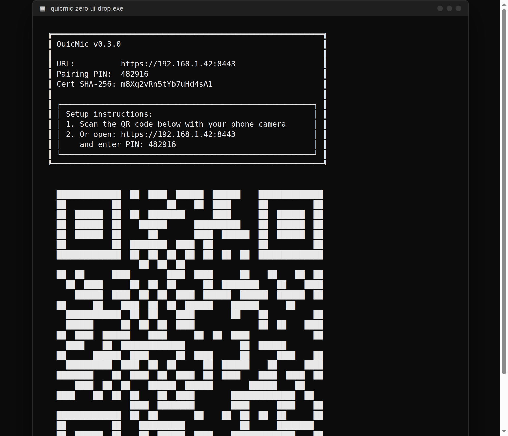

# QuicMic Zero UI

One Windows app, three screens. Your phone becomes a **wireless mic**, a **file-drop station**, and a **wireless speaker** for your PC — all over your local network. No accounts, no cloud, no app install on the phone.

**Download:** grab `quicmic-zero-ui-drop.exe` from the [private release](https://github.com/crtGhoul/quicmic-zero-ui/releases/tag/v0.3.0-zero-ui) and double-click it.

## The PC window

This is what you see when you start the exe. It shows a QR code, the phone URL, and a 6-digit pairing PIN (values below are illustrative — yours will differ):

While it runs, the window logs what's happening: `Phone paired successfully`, `Mic client connected`, `Speaker client streaming`, and disconnects — each with the phone's IP, so you can see at a glance what's live.

### Console commands

The window is interactive — type a command and press Enter while it runs:

- `status` — live panel: connected Mic/Speaker clients, mic output device, speaker capture source, volume/gain/gate/latency, monitor state
- `qr` — reprint the pairing QR code (handy if it scrolled away)
- `drop` — print the LocalDrop link (also shown at startup) for phone↔PC file sharing
- `devices` — list PC audio output devices
- `device <n|name>` — switch the mic output device live, no restart
- `speaker-devices` — list PC playback devices the Speaker tab can capture from
- `speaker-device <n|name>` — switch which device the Speaker tab captures, live (headphones vs Bluetooth vs speakers…)
- `volume <0-5>` / `gain <0.2-3>` / `gate <-100-0>` / `latency <0-500>` — DSP settings, applied immediately
- `monitor <on|off>` — mute the hear-yourself monitor
- `theme <neon|ghoul|plain>` — switch the banner theme live
- `quit` — graceful shutdown (same as Ctrl+C)

The phone UI stays the source of truth for saved settings — it can reapply volume/gain/gate/latency when it reconnects. You can also pick the theme at startup: `quicmic.exe --theme ghoul`. The speaker capture device is selectable at startup too: `quicmic.exe --speaker-device headphones`.

## The phone screens

Scanning the QR now opens a **landing page** — pick Mic, Drop, or Speaker. It can also be installed like a real app (see below).

Switch between the three screens from the top nav on any page.

| 🎤 Mic | 📦 Drop | 🔊 Speaker |
|---|---|---|
|  |  |  |

### Install as an app (PWA)

No App Store needed — the pages are an installable web app:

- **iPhone:** open the landing page in Safari → Share → **Add to Home Screen**. It opens fullscreen with the QuicMic icon.
- **Android:** open it in Chrome — you'll get an **Install as an app** prompt (or Menu → Add to Home screen).

The installed app opens straight to the chooser, works offline from cache for the UI shell, and the pairing PIN rides along in the link.

## Quick start

1. **PC:** run `quicmic-zero-ui-drop.exe`. The console window prints a QR code, a URL like `https://192.168.x.x:8443`, and a 6-digit PIN.
2. **Phone** (on the same Wi-Fi): scan the QR with your camera, **or** open the URL in your browser and type the PIN.
3. Done — pairing sticks, you only do it once.

### 🎤 Mic — phone as wireless PC microphone

Tap the big button to mute/unmute. Gestures:

- **Tap** — mute / unmute
- **Long-press** — Eco mode on/off
- **Swipe up/down** — PC output volume (with a HUD readout)
- **Swipe up from the bottom edge** — settings drawer (devices, volume, hear-yourself monitor)

Tip: run the exe with `--monitor-device` if you want the hear-yourself toggle in the drawer — wear headphones when testing it.

### 📦 Drop — send anything to nearby devices

Photos, files, text & links straight over your local network, peer-to-peer and encrypted (WebRTC).

- **Share** — host a session and get a code
- **Receive** — join with a code
- **Nearby & ready** — set a matchmaker server URL in ⚙ Settings and devices on your network show up automatically. No matchmaker? The Share/Receive codes work fine without one.
- The status dot turns green when Drop is connected.

> Prefer a standalone page? The console prints the [LocalDrop](https://crtghoul.github.io/localdrop/) PWA link at startup (or type `drop`) — same idea, send pictures/files/text/links between nearby devices, no install needed.
### 🔊 Speaker — hear your PC through your earbuds

1. Pair your Bluetooth earbuds to your **phone**.
2. Open the **Mic** tab once and pair (Speaker reuses that pairing).
3. Open the **Speaker** tab, tap **Connect**, then play anything on the PC — music, video, games.

The page shows a live level meter, a volume slider, and frame stats. ⚙ Settings has auto-connect, an 880 Hz test tone to check the phone→earbuds path without the PC, and a **Stream latency** preset (Low ~40 ms / Balanced ~100 ms / Smooth ~240 ms) — a jitter buffer that trades a little delay for stutter-free audio on flaky Wi-Fi. If you hear dropouts, switch it up a notch; it applies live.

**Which PC audio gets streamed?** By default it's whatever Windows is playing through your *default* output device. To capture a specific one — headphones vs Bluetooth vs speakers — use the PC console: `speaker-devices` lists them, `speaker-device headphones` switches live (or start with `quicmic.exe --speaker-device headphones`).

> Heads-up: the three tabs are separate pages, so switching tabs unloads the current one. To run Mic and Speaker **at the same time**, open them in two browser tabs side by side.

## iPhone: trusting the certificate

The PC uses a self-signed certificate, so Safari shows a warning on first visit. That's expected:

1. Open the URL in Safari, tap *Show Details* → *visit this website*.
2. The PC window shows a **Cert SHA-256** fingerprint — check it matches, so you know it's your PC.
3. Trust it permanently in **Settings → General → About → Certificate Trust Settings**.

## Troubleshooting

- **Drop dot stays gray** — check the matchmaker URL in Drop's ⚙ Settings, or skip discovery entirely and use Share/Receive codes (pure LAN).
- **Speaker says "pair on the Mic tab first"** — open Mic and complete pairing once.
- **Speaker connects but no sound** — it captures the PC's *default output* device; check that's the right one, and try the 880 Hz test tone to verify the phone→earbuds path.
- **Underruns keep climbing** — Wi-Fi congestion; move closer to the router.
- **Mic page asks for the PIN again** — your phone's saved pairing expired; re-pair from the PC window.

## Privacy

Everything stays on your LAN. Mic and Speaker stream directly between your PC and phone. Drop transfers are peer-to-peer; the matchmaker server only helps devices find each other.

---

*Built by Strider.*
